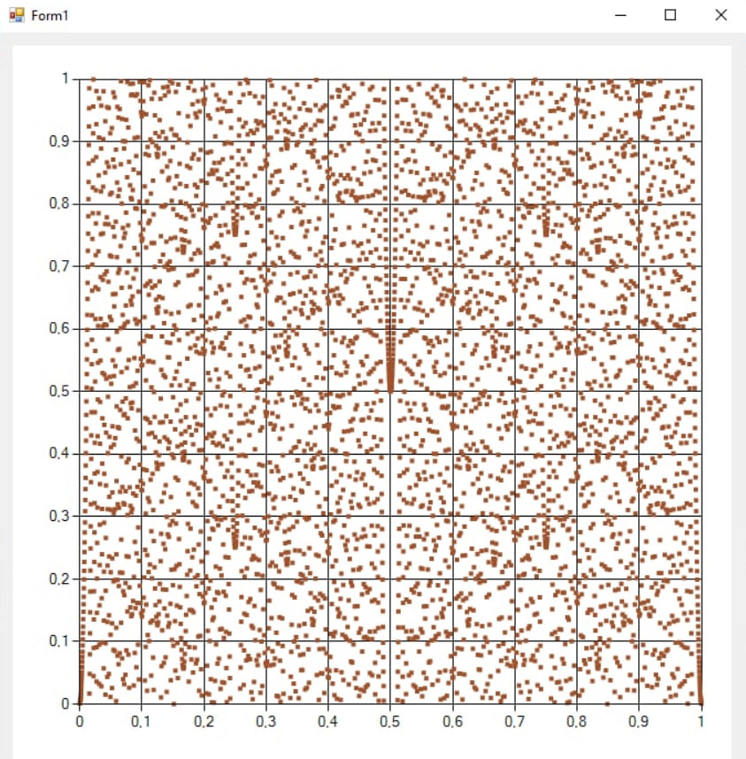
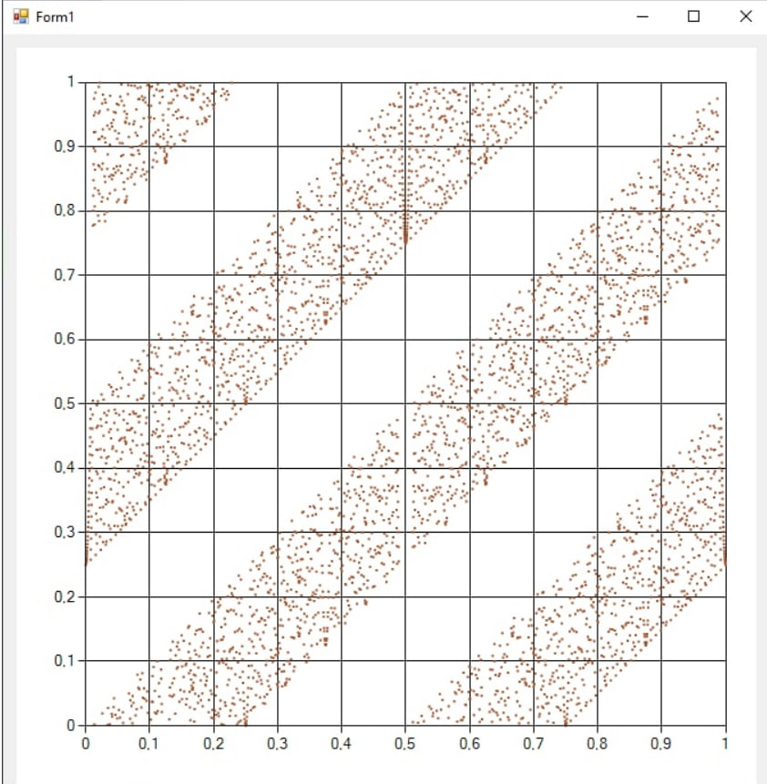
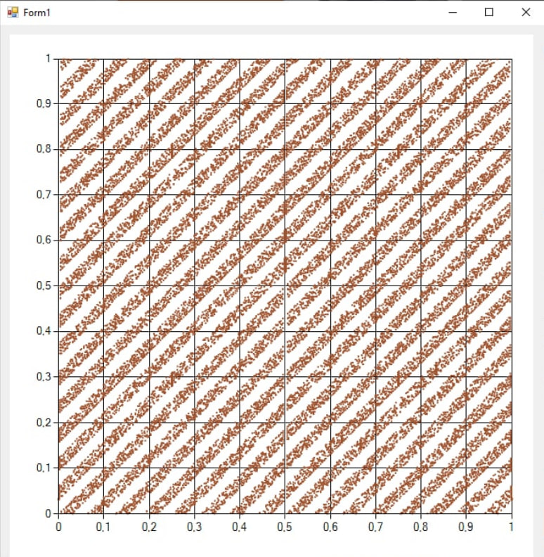
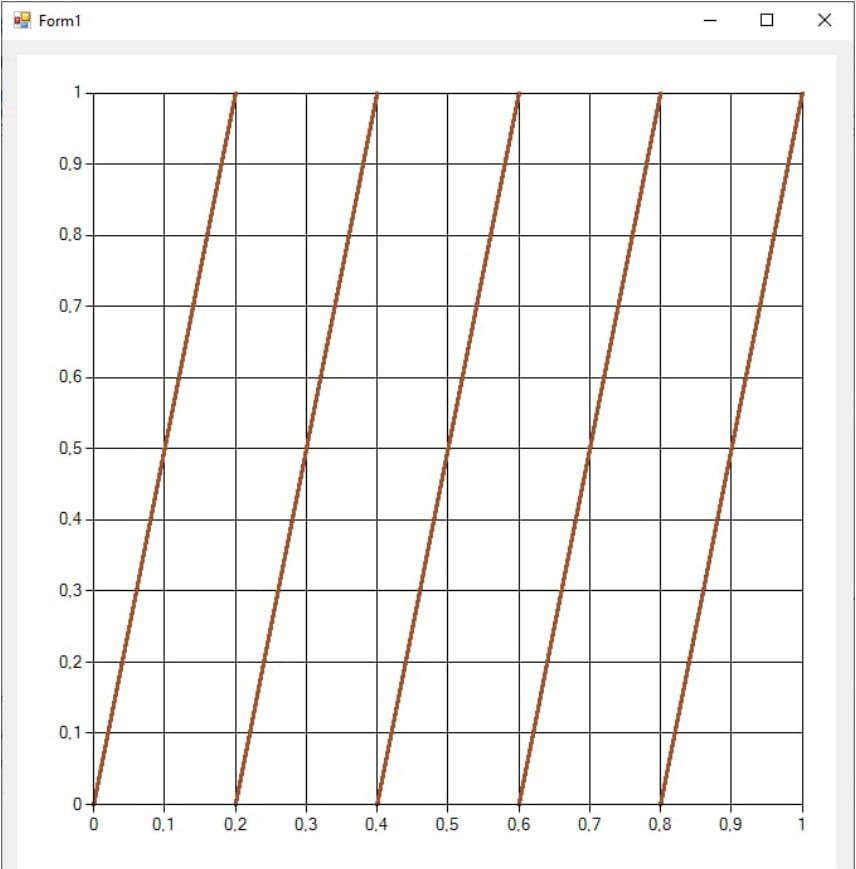
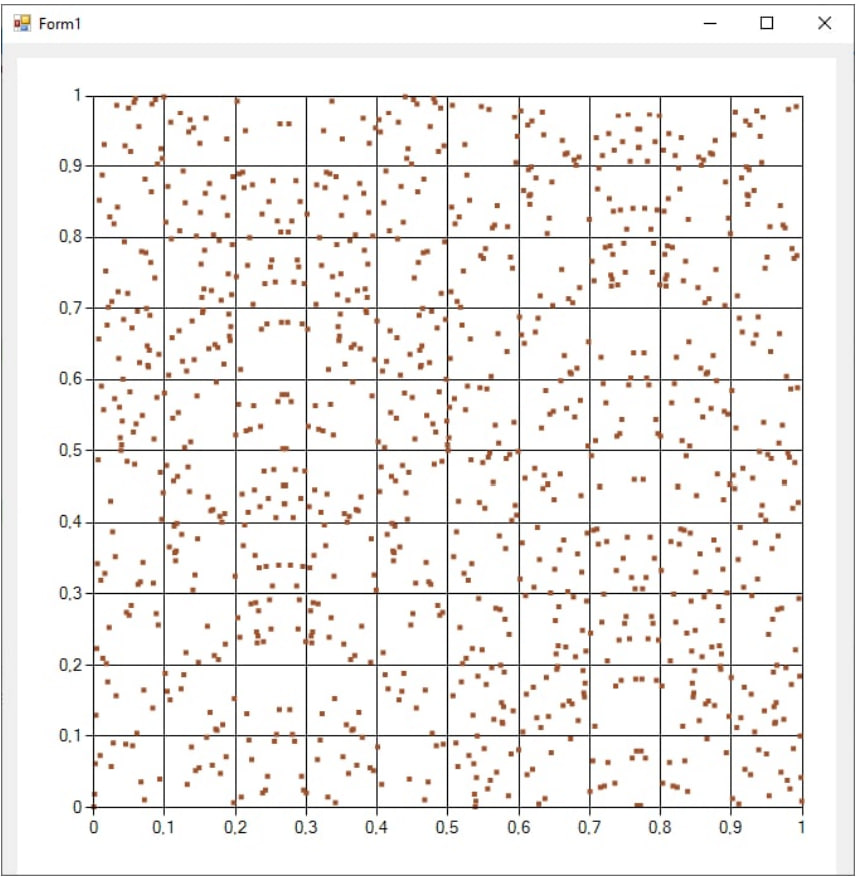
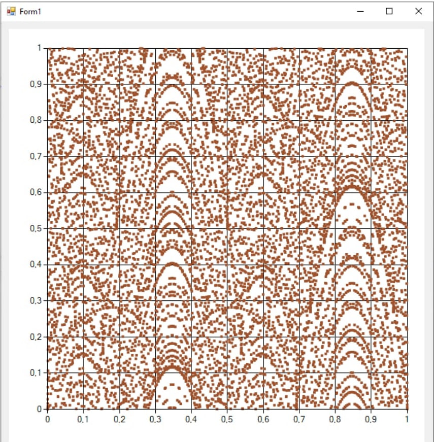
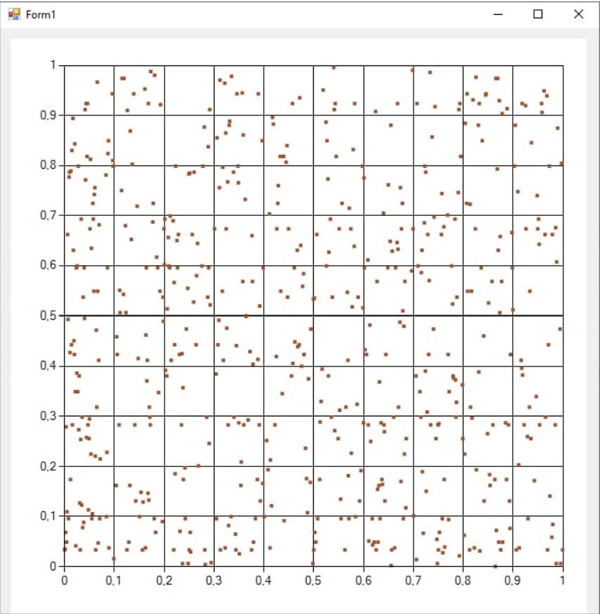
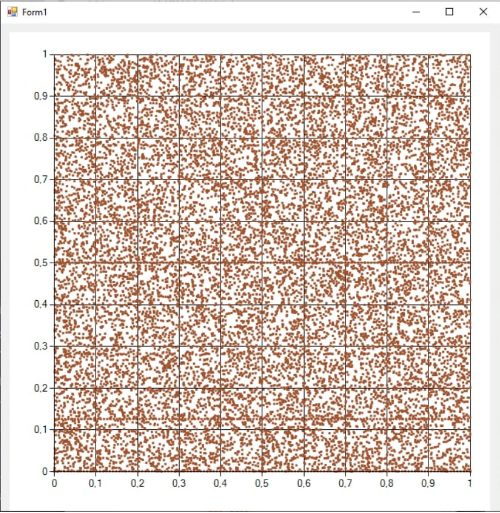

# 1. Генераторы псевдослучайных чисел и T-функция
В языках программирования, как правило, предусмотрены функции, позволяющие генерировать случайные числа в определенном по умолчанию диапазоне. На самом деле генерируются не случайные, а так называемые псевдослучайные числа. Никакой детерминированный алгоритм не может генерировать полностью случайные числа, а только лишь аппроксимировать некоторые свойства случайных чисел. Для человека полученная последовательность выглядит довольно случайной, но  вычисляется она по вполне конкретной формуле. 

**Детерминированный алгоритм** - это алгоритм, который при определенном входе всегда будет выдавать один и тот же результат, а базовая машина всегда будет проходить через одну и ту же последовательность состояний.

Начиная с состояния $x_0$, которое называют **ключом** (он секретен), автомат в процессе функционирования, такт за тактом, порождает последовательность строк из $m$ бит каждая. Полученная
таким образом последовательность образует гамму. В качестве функции $f$ берутся так называемые T-функции. 

**T-функция** - биективное отображение, которое обновляет каждый бит состояния таким образом, который может быть описан как $\displaystyle x_{i}'=x_{i}+f(x_{0},$ $\dots ,x_{i-1})$, или простыми словами функция обновления, в которой каждый бит состояния обновляется линейной комбинацией одного и того же бита и функцией подмножества его менее значимых битов.

Т-функции - это класс обратимых отображений, которые совмещают в себе арифметические и булевы операции, выполнение которых производится над целыми машинными словами.
Очевидно, что композиция Т-функций снова есть Т-функция, поэтому, соединяя элементарные инструкции в программу, мы довольно часто получаем, что результирующее отображение (т.е. программа) является Т-функцией.

Рассмотрим преобразование в котором каждая переменная на входе состоит из $n$ бит и $m$ входных переменных расставленых в $m$ строк матрицы $m \times n$. Тогда Т-функция определяется следующим отображением:
$$f: \mathbb{B}^{m \times n} \rightarrow \mathbb{B}^{k \times n},$$ 

где $\mathbb{B}=\{0,1\}$, а k-й столбец на выходе зависит только от первых k столбцов на входе. В общем случае, для вычисления k-ого выходного бита необходимо знать $0,1, \dots, k$ входных бит.

Для использовании генератора случайных чисел в криптографии он должен отвечать следующим требованиям:
##### 1. Псевдослучайность: 
T-функция должна обеспечивать равномерное распределение и длинный период получаемой последовательности. Идеальный вариант, когда линейная сложность стремится к бесконечности.
##### 2. Стойкость:
Генератор должен выдерживать атаки. Cогласно теореме Шеннона, шифрование является совершенным, другими словами абсолютно стойким, если гамма является случайной и равновероятной последовательностью.
##### 3. Быстродействие:
Чтобы генератор допускал простую программную реализацию, обе функции $f$ и $G$ должны быть несложной композицией элементарных команд процессора: арифметических операций (XOR, OR, AND, NOT).

# 2. Разработка приложения для построения проекций T-функций
## 2.1 Описание приложения
На вход программы поступает T-функция и значение N. По этим данным приложение строит графики в единичном квадрате. На плоскости отображаются точки с координатами $(x/2^N; F(x)~ mod 2^N/2^N),$ где $x$ пробегает множество $\{0, 1, 2, \dots, 2^N -1\}$. Элементы этого множества называются вычетами по модулю $2^N$, они представляют собой всевозможные двоичные сроки длины N. Так вот, графики будут демонстрировать распределение соседних пар в последовательности $x, f(x), f(f(x)),\dots$. Графики дают экспериментальное наблюдение линейной сложности: если линейная сложность невысокая, точки $(x/2^N; f(x)~ mod 2^N/2^N)$ попадут на конечное число параллельных прямых.
## 2.2 Этапы работы программы
Приложение было написано на языке C# с использованием интерфейса программирования приложений Windows Forms. В начале инициализируеются переменные: значение N --- число младших разрядов для всех двоичных строк, переменные a и b -- содержат левую и правую границы для значения $x$, $y$ принимает значение T-функции для каждого $x$. С помощью команды AddXY точка наносится на плоскоть единичного квадрата
## 2.3 Примеры работы программы
Для того, чтобы продемонстрировать работу приложения, были выбраны функции для изучения их линейной сложности
##### 1. Начнём с T-функции Климова-Шамира: $f = x + (x^2 \vee C)$
Из графиков очевидно, что при увеличении параметра N линейные зависимости проявляются всё больше и больше. Хоть
здравый смысл и говорит, что чем длиннее используемый ключ, тем
сложнее его подобрать, для данной T-функции это работает в обратую сторону.

T-функция Климова-Шамира. С = 1024, N = 10:

T-функция Климова-Шамира. С = 1024, N = 12:

T-функция Климова-Шамира. С = 1024, N = 15:

##### 2. Изучим линейную функцию $f = 5x +1$
Стоит отметить, что при увеличении значения N лишь увеличивается
плотность линий. Понятно, что использовать такую функцию для
генерации случайных чисел — опрометчиво.
Линейная функция $f = 5x +1, N = 20$, 

##### 3. Рассмотрим квадратичную функцию $f = 13x^2+ 5x +1$
В этом случае легко можно заметить линейные зависимости,
которые тоже становятся более выраженными при увеличении $N$

Квадратичная функция $f = 13x^2+ 5x +1, N = 10$

Квадратичная функция $f = 13x^2+ 5x +1, N = 13$

##### 4. Возьмём в качестве T-функции многочлен пятой степени: $f =  x^5 + x^2 +34$
На рисунках видны линейные зависимости выраженные
горизонтальными прямыми.
Многочлен пятой степени $f =  x^5 + x^2 +34, N = 10$:

Многочлен пятой степен $f =  x^5 + x^2 +34, N = 13$:

# Вывод
В последние десятилетия  всё больше и больше информации переносится в цифровой мир, соответственно значительная часть этой информации должна быть конфидециальна. Криптография как часть системы защиты информации развивается и появляются новые методы шифрования данных, но они тоже используют генераторы псевдослучайных чисел, которые до сих пор не идеальны. 

Человечеству предстоит ещё долго совершенствовать T-функции, чтобы получать максимальную скорость вычисления и высокую безопасноть информации. В анализе T-функций для изучения её линейной сложности поможет алгоритм, рассмотренный в данной работе.
